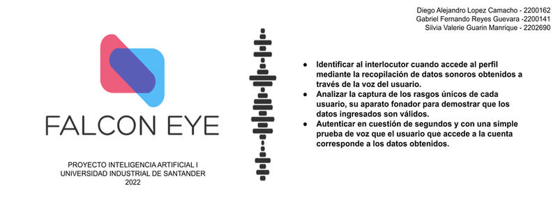

# Falcon-Eye---Reconocimiento-de-voz

## Authors

Diego Alejandro Lopez Camacho - 2200162 - Grupo H2 

Gabriel Fernando Reyes Guevara - 2200141 - Grupo J1

Silvia Valerie Guarin Manrique - 2202690 - Grupo H2

## Objetivo

Identificar por medio de una inteligencia artificial los rasgos de la voz para validar, clasificar y contorlar, por medio de la edad y genero, la autenticidad de un usuario.

## Dataset

[COMMONVOICE](https://commonvoice.mozilla.org/es/datasets)

## Modelos

RED NEURONAL - REGRESION - CLASIFICACIÓN - RANDOMFOREST - SVC - PYTHON - GaussianNB - librosa - noisereduce - soundfile - tensorflow

## Enlaces

[NOTEBOOK](https://colab.research.google.com/drive/1gEy2kl656Cppxzw3NJ3bhvkbL6SNqsPz?usp=sharing)

[VIDEO](www.yputube.com)

